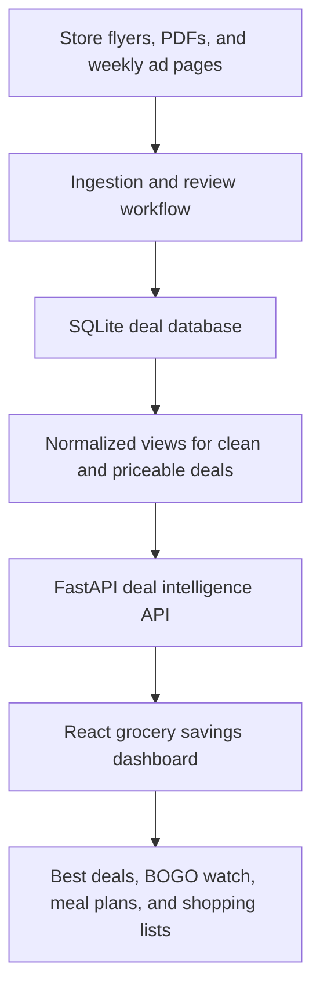
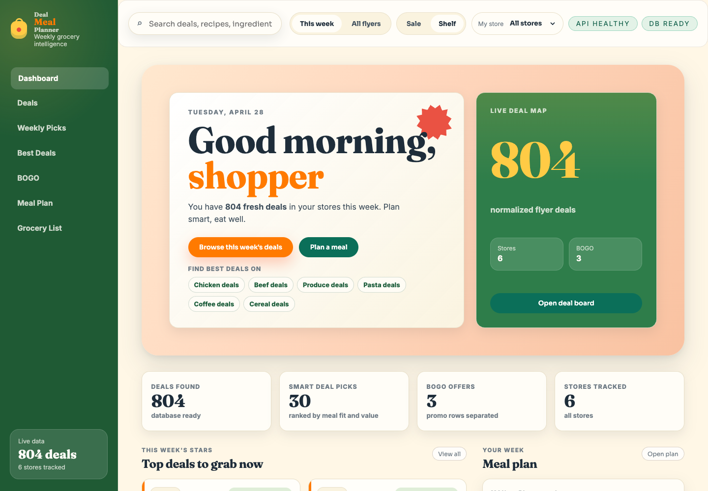
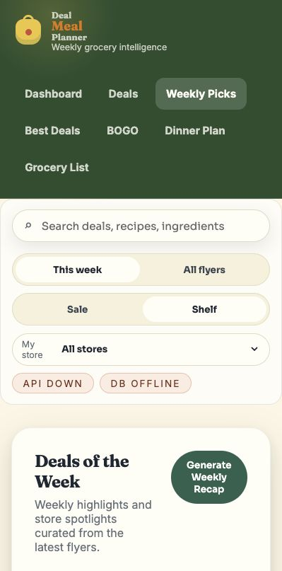
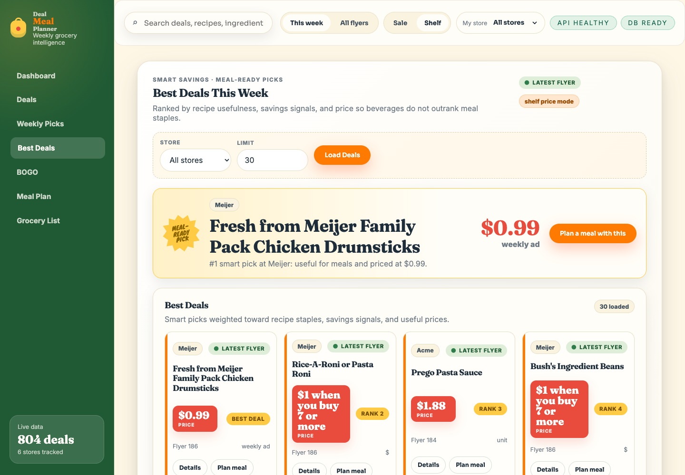
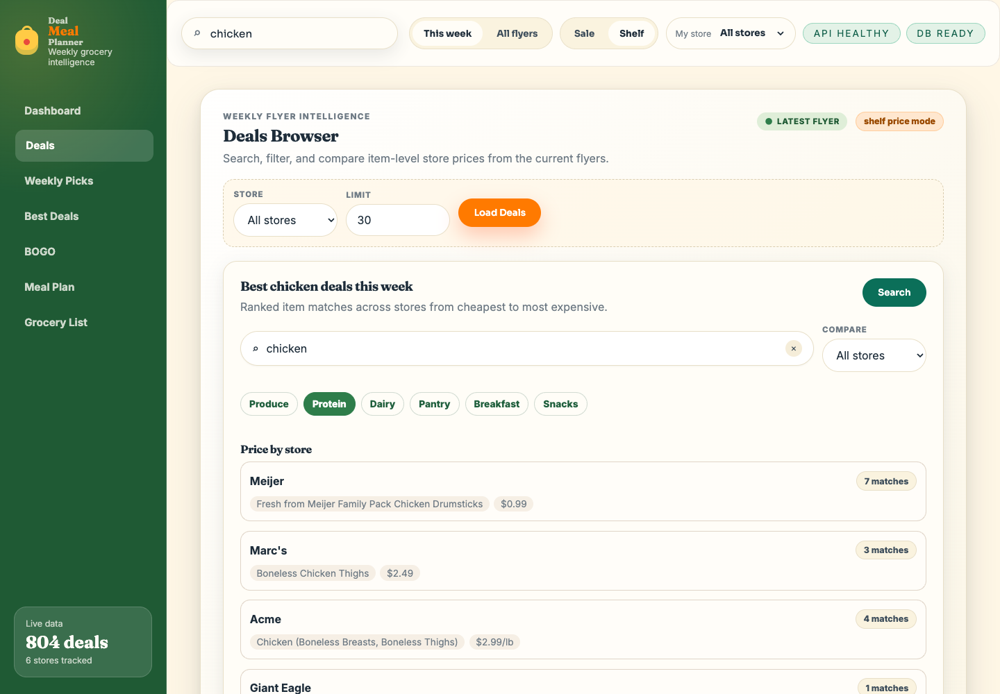
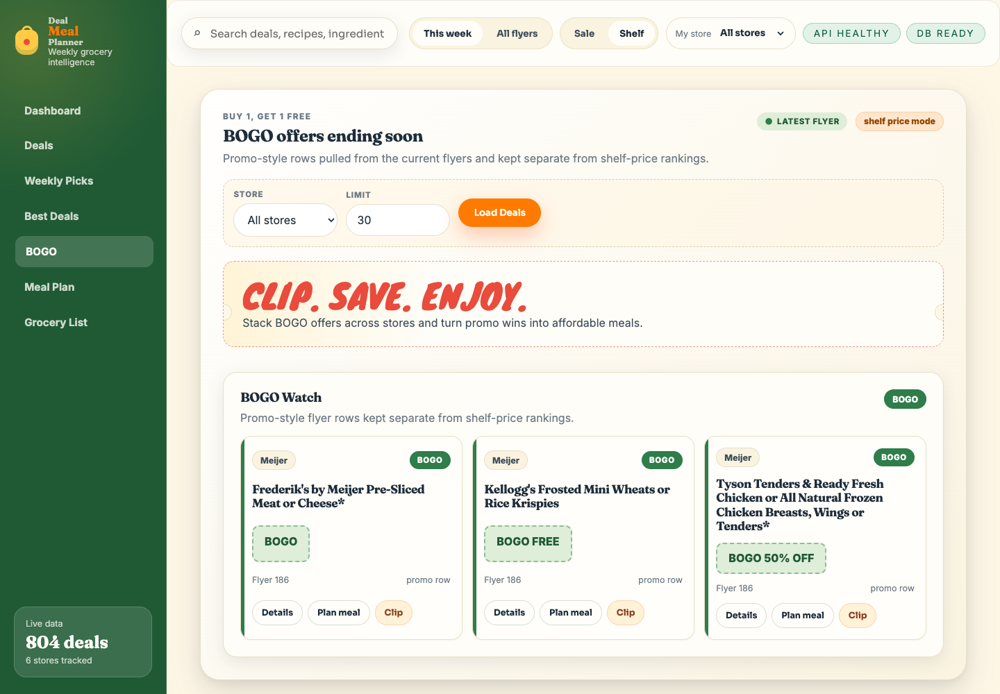
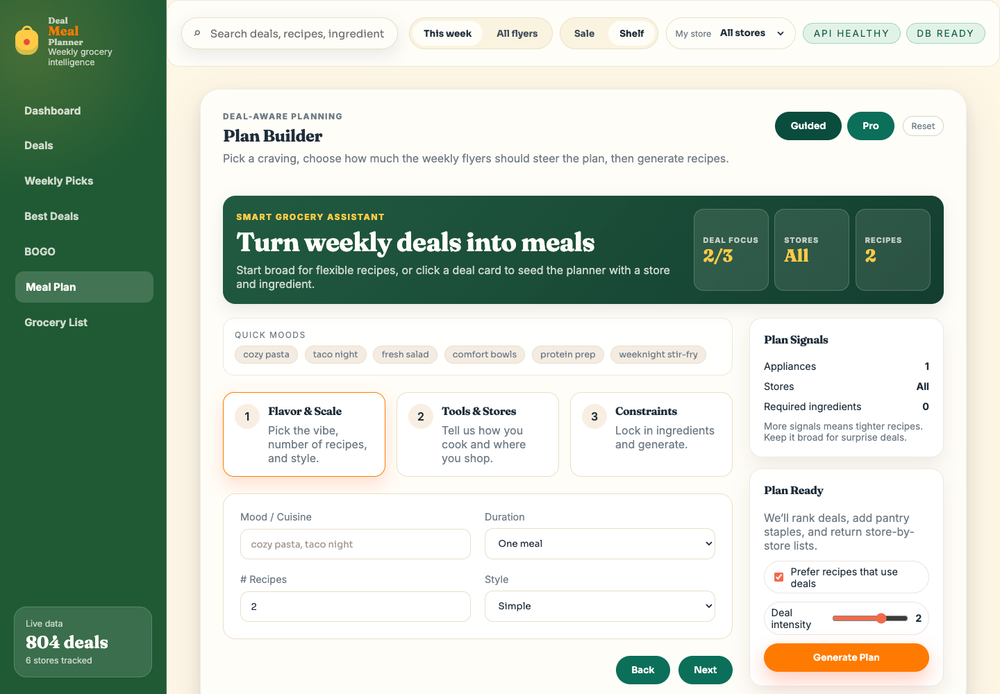
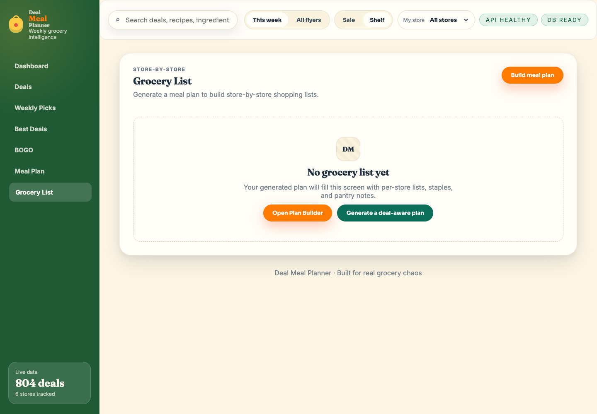

# Deal Meal Planner Case Study

Deal Meal Planner is an API-driven grocery deal intelligence platform that turns weekly grocery flyer data into searchable deals, ranked picks, meal ideas, and store-by-store shopping lists.

This is a public portfolio case study. The production source code, ingestion scripts, credentials, generated databases, and operational files are intentionally kept private.


[Watch the 61-second MP4 demo](assets/demo/deal-meal-planner-demo.mp4)

## Why I Built It

Weekly grocery savings are useful, but the information is scattered across store flyers, PDFs, promotional text, and time-limited weekly ads. A shopper can see a sale price, but it is hard to compare stores, identify the deals that are actually useful for meals, and turn those deals into a practical shopping plan.

Deal Meal Planner treats that messy consumer problem as an engineering system: ingest data, normalize it, expose it through APIs, and design a frontend that helps people make decisions.

## Product Summary

The app helps users:

- See current weekly deal coverage across multiple stores.
- Search for deal matches like chicken, cereal, pasta, produce, or pantry staples.
- Compare item matches by store.
- View BOGO and promotional rows separately from shelf-price rankings.
- Generate deal-aware meal ideas.
- Build a shopping list that preserves deal context.

## Tech Stack

- Backend: FastAPI, Python, SQLite
- Frontend: Vite, React, JavaScript, CSS
- Data layer: normalized SQLite tables and views
- Deployment shape: Linux host, PM2-managed services, static frontend serving, Cloudflare Tunnel
- AI-assisted workflows: flyer extraction experiments and recipe generation guardrails

## Architecture



The core engineering challenge was not just displaying grocery deals. It was making messy, inconsistent, time-sensitive flyer data behave like a usable product system.

## Product Screens

### Dashboard

Live product status, tracked stores, deal counts, and weekly deal summary.



### Weekly Picks

Store-by-store featured deals with category sections and links back to each store's weekly ad.



### Best Deals

Smart-ranked deals designed to favor meal-useful grocery items rather than simply choosing the lowest shelf price.



### Deal Finder

Search and compare deal matches across stores.



### BOGO Watch

Promotion rows are separated from numeric shelf-price rankings so the UI does not pretend every promo is directly price-comparable.



### Meal Planning

Deal-aware recipe planning with user constraints such as required ingredients and exclusions.



### Grocery List

Shopping-list output designed around stores, deal context, and recipe needs.



## API Design Examples

These are representative local-development requests that show the API surface without exposing private deployment details. They are included to demonstrate endpoint design, not as a public hosted API.

```bash
# Representative local health check
curl -sS http://localhost:8000/health

# Representative deal metadata request
curl -sS http://localhost:8000/api/deals/meta

# Representative smart-ranked current weekly deals request
curl -sS "http://localhost:8000/api/deals/best?limit=10&price_mode=shelf&rank_mode=smart&flyer_kind=weekly"

# Representative BOGO and promotional rows request
curl -sS "http://localhost:8000/api/deals/bogo?limit=10"

# Representative item search across stores request
curl -sS "http://localhost:8000/api/search?q=chicken&limit_stores=10"
```

## Engineering Decisions

- Used SQLite because the project needed inspectable local data, normalized views, and a simple deployment path.
- Separated BOGO/promotional rows from price-comparable rows to avoid misleading rankings.
- Added smart deal ranking so meal-useful items can outrank cheap but low-utility products like beverages.
- Designed API parameters for debugging and product behavior, including store filters, flyer scope, price mode, rank mode, limit, and offset.
- Kept generated data, flyer artifacts, API keys, admin credentials, and Cloudflare tunnel details out of public version control.

## What I Learned

- Real-world data quality problems drive better architecture than toy examples.
- A useful API needs to serve both frontend workflows and debugging workflows.
- Product polish is often about preventing misleading outputs, not just adding features.
- Portfolio projects become more credible when they include health checks, setup thinking, screenshots, demos, and a clear explanation of tradeoffs.
- My teaching background maps directly to product engineering: break messy problems into learnable systems, design feedback loops, and make complex workflows understandable.

## Interview Talking Points

- How flyer data moves from messy source material into normalized API responses.
- Why BOGO deals and numeric shelf-price deals need different treatment.
- How smart ranking balances price, savings, category, and meal usefulness.
- How frontend state connects search, filters, meal planning, clipped deals, and grocery lists.
- What I would harden next: CI, ingestion scheduling, observability, user auth, source/data boundaries, and production deployment.

## Resume Bullets

- Built a full-stack grocery deal intelligence platform using FastAPI, SQLite, and React to ingest, normalize, rank, and surface weekly retail flyer deals.
- Designed API endpoints for deal metadata, best-deal ranking, BOGO promotions, item search, and deal-aware meal generation.
- Modeled messy flyer data through SQLite tables and normalized views, separating price-comparable deals from promotional rows.
- Implemented a React/Vite frontend with API health indicators, store filters, deal cards, search workflows, generated recipe views, and shopping-list flows.
- Deployed and operated the app on a Linux host with PM2-managed services, static SPA serving, and Cloudflare Tunnel routing.

## Source Code Boundary

The public case study is intentionally source-free.

Private materials include:

- backend source code
- frontend source code
- ingestion scripts
- store-specific automation logic
- generated SQLite databases
- raw flyer files and exports
- private runbooks
- credentials, tokens, API keys, and environment files

This lets the project be visible as a portfolio artifact while protecting the implementation and operational details.
